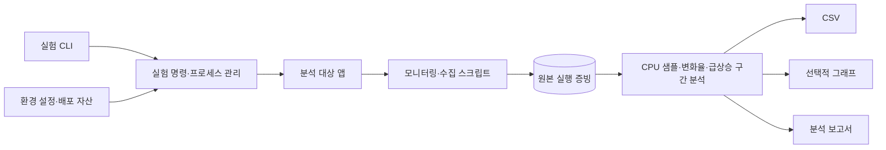

# 시스템 장애 분석 랩

## 프로젝트 소개

제공된 `agent-app-leak` 앱의 메모리 압박, CPU 급상승, 데드락, 스케줄링 동작을 재현하고 분석하는 실습입니다. 원본 로그, 분석 도구, 해석 보고서를 나눠 관리합니다.

## 핵심 특징

- 하나의 CLI에서 대상 앱 실행·모니터링·증거 수집
- 시나리오별 원본 표준 출력·오류·프로세스 로그
- CPU 변화율과 급상승 구간 분석
- 관찰 결과와 해석을 구분한 장애 보고서
- 원본 증빙을 덮어쓰지 않는 임시 출력 기반 검증

## 아키텍처

`대상 앱 → 수집 스크립트 → evidence → 분석 도구 → reports` 흐름입니다. `src/failure_lab/`은 실험 실행을, `src/failure_lab/cpu_spike/`는 저장된 샘플의 분석을 담당합니다.

| 경로 | 역할 |
| --- | --- |
| `src/failure_lab/` | 대화형·명령형 실험 CLI |
| `config/env-default.sh` | 대상 앱의 실험 환경 |
| `assets/` | 기존 분석 대상 바이너리와 압축본 |
| `scripts/` | 모니터링·수집·검증 |
| `src/failure_lab/cpu_spike/` | CPU 로그 분석과 CSV·보고서·선택적 그래프 생성 |
| `evidence/` | 원본 실행 증빙 |
| `reports/` | 장애 시나리오별 해석과 결론 |



소스는 `src/failure_lab/`, 회귀 테스트는 `tests/`, 개발 보조 도구는 `scripts/`에 둡니다. `pyproject.toml`이 패키지·명령·개발 도구를 선언하고 `uv.lock`이 설치 버전을 고정합니다. `uv sync --frozen`은 소스를 개발 모드로 설치하므로 앱 실행과 테스트에 별도 `PYTHONPATH` 설정이 필요하지 않습니다.

## 실행 환경과 시작하기

Python 3.10 이상과 Bash를 사용합니다. 대상 바이너리 실행은 Linux 실습 환경이 필요합니다. 저장된 로그 분석과 문법 검사는 대상 앱 없이 실행할 수 있습니다. 그래프 생성에만 선택적으로 `matplotlib`을 사용합니다.

```bash
uv sync --frozen
make check
make test
make smoke
make build
```

`make smoke`는 저장된 CPU 로그를 임시 폴더로 분석하며 바이너리 실행이나 시스템 설정 변경은 수행하지 않습니다.

그래프까지 생성하려면 `uv run --frozen --extra plot cpu-spike`로 선택 의존성을 포함해 실행합니다. 기본 설치는 표준 라이브러리만으로 CSV와 보고서를 생성합니다.

## 실험 실행

```bash
uv run --frozen failure-lab
uv run --frozen failure-lab check
```

`start`, `stop`, `edit-env`, `monitor`, `sample-cpu`, `collect`, `analyze-cpu` 명령을 제공합니다. OOM·CPU 부하·데드락 실험과 `stop`은 시스템 자원·프로세스에 영향을 주므로 준비한 실습 환경에서 [사용법](docs/usage.md)에 따라 실행합니다. `collect`와 `sample-cpu`는 `.runtime/`의 새 실행 디렉토리에 기록합니다. `--output`으로 새 경로를 지정할 수 있으며 기존 경로는 거부합니다. 기본 분석 출력도 `.runtime/cpu-analysis/`에 보관하고, 기존 분석 출력의 교체에는 `cpu-spike --overwrite`가 필요합니다.

원본 로그를 보존하며 분석하려면 출력 경로를 별도로 지정합니다.

```bash
mkdir -p .runtime
uv run --frozen cpu-spike --input evidence/cpu/spike/monitor_cpu.log --csv .runtime/cpu.csv --report .runtime/cpu.md --plot .runtime/cpu.png
```

## 검증

```bash
make check
make test
make smoke
```

`make check`는 정적 분석·포맷·문서 검사를, `make test`는 저장 로그 분석과 안전하게 격리한 모니터·수집 회귀 테스트를 실행합니다. 워커 PID 선택, 방화벽 상태, 원본 증빙 보호, 앱 종료 코드·수집 실패 전달을 임시 파일과 가짜 앱·명령으로 확인합니다. `make smoke`는 문법 검사와 저장 CPU 로그의 임시 출력 분석만 선택합니다(`uv run --frozen pytest -q -m smoke`). 실제 장애 재현과 수정한 수집기의 실호스트 동작은 이 테스트의 검증 범위에 포함하지 않습니다.

## 분석 자료

- [프로젝트 구조](docs/structure.md), [사용법](docs/usage.md), [증빙 안내](evidence/README.md)
- [메모리 압박](reports/oom.md), [CPU 부하](reports/cpu.md), [CPU 급상승](reports/cpu_spike.md)
- [데드락](reports/deadlock.md), [스케줄링](reports/scheduling.md)

기존 증빙은 과거 실험의 기록이며 현재 호스트에서 동일한 결과가 나왔다는 의미는 아닙니다.
