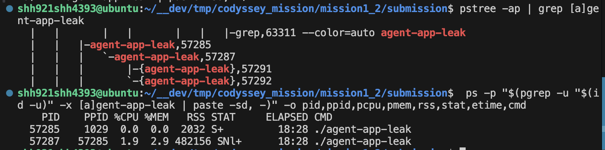
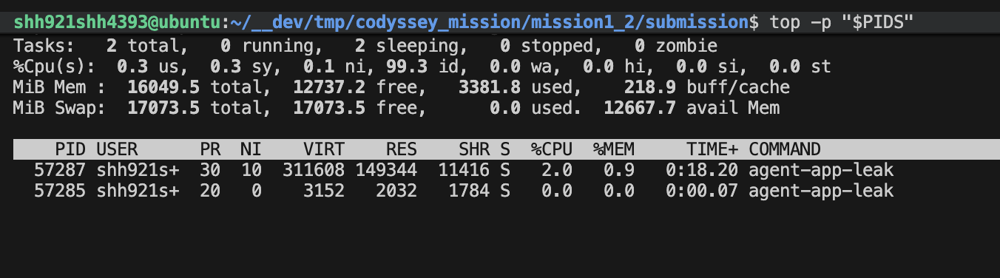
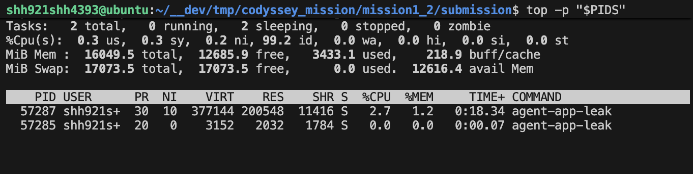
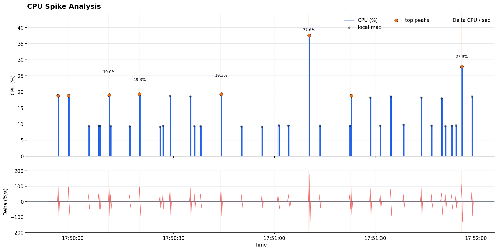

# [장애] CPU 가드 위반 - 저장된 CpuWorker 로그 비교

## 1. 현상 설명

이 보고서는 2026-06-13의 과거 원본 로그를 대조한 해석이며 새 실험을 실행한 결과가 아니다. CPU 케이스는 `MULTI_THREAD_ENABLE=false`의 로그에서 정상 시작과 `CpuWorker` 실행을 확인했다. 두 구성을 비교했다:

- 이전: `CPU_MAX_OCCUPY=100`
- 이후: `CPU_MAX_OCCUPY=10`

`CPU_MAX_OCCUPY=100`에서는 `CpuWorker`의 가드 위반이 기록됐다. `CPU_MAX_OCCUPY=10`에서는 관측 구간에 `10.00%`에 도달한 뒤 냉각으로 들어간 기록이 남았다. 실제 종료 코드는 보존되어 있지 않다.

## 2. 증거 자료

보조 스크린샷(해당 두 실행의 PID·수집 시각과 일치하는지는 확인하지 않음):







원본 증거:

- `evidence/cpu/cpu-max-100/stdout.log`
- `evidence/cpu/cpu-max-100/agent_app.log`
- `evidence/cpu/cpu-max-10/stdout.log`
- `evidence/cpu/cpu-max-10/agent_app.log`


프로그램 로그 발췌:

```text
CPU_MAX_OCCUPY=100:
[CpuWorker] Started. Maximum CPU Limit: 100%
[CpuWorker] Current Load: 51.12%
[CpuWorker] CPU Threshold Violated! (51.11999999999999%).

CPU_MAX_OCCUPY=10:
[CpuWorker] Started. Maximum CPU Limit: 10%
[CpuWorker] Peak reached (10.00%). Starting cooldown...
```

CPU 변화율 분석:



- `evidence/cpu/spike/monitor_cpu.log`
- `evidence/cpu/spike/cpu_spike.csv`
- `evidence/cpu/spike/cpu_spike.png`
- [CPU 급상승 분석 보고서](cpu_spike.md)

## 3. 원인 분석

CPU 이슈는 에이전트의 자체 `CpuWorker` 가드가 제어한다. 완화된 `CPU_MAX_OCCUPY=100`은 부하가 약 `50%`를 넘긴 뒤 `CPU Threshold Violated` 로그가 발생하도록 허용했다. 이는 무작위 크래시가 아니라 보호 종료 경로다.

`CPU_MAX_OCCUPY=10`에서는 작업자가 `10.00%`를 피크로 간주하고 냉각에 들어간다. 비교 결과 환경 변수가 작업 부하가 위반 범위로 상승하는지 여부를 바꾸는 것을 보여준다.

## 4. 조치 및 검증

우회 방법:

- 이 테스트 환경에서는 `10`과 같은 보수적인 `CPU_MAX_OCCUPY`를 사용한다.
- CPU 동작을 데드락 동작과 분리할 때는 `MULTI_THREAD_ENABLE=false`를 유지한다.

이전 및 이후:

- `CPU_MAX_OCCUPY=100`: 앱 로그의 부하가 `51.12%`까지 올라가 `CPU Threshold Violated`가 발생.
- `CPU_MAX_OCCUPY=10`: 부하가 `10.00%`에 도달한 뒤 관측 구간 동안 위반 로그 없이 냉각.

현재 원본 로그는 환경별 가드 위반·냉각 기록을 뒷받침한다. `cpu-max-100/ps_top.log`는 비어 있고 두 구성의 모니터는 각각 2개 샘플 뒤 TCP 연결 실패로 끝난다. 모니터는 워커 대신 RSS 1.9MB의 런처를 측정했으므로 실제 워커의 CPU 부하·종료를 입증하는 자료로 사용할 수 없다. 새 수집기는 워커 PID·실패 상태를 보존하도록 수정했지만 실제 부하 실험은 재실행하지 않았다. 별도 spike 로그 분석은 재현되며 해당 로그를 이 가드 비교 실행과 동일한 관측으로 합치지 않는다.
